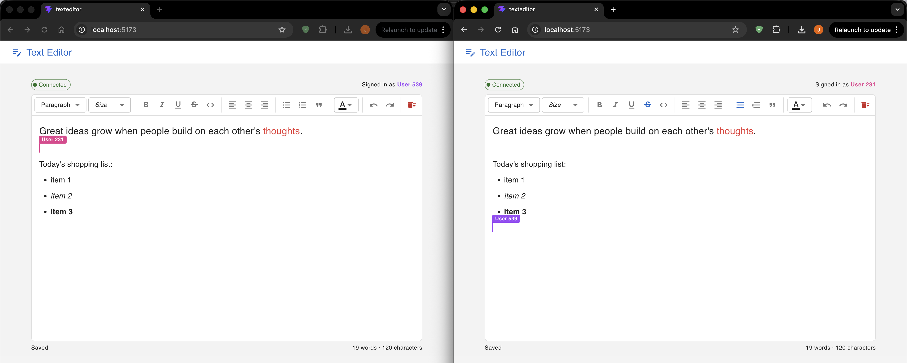

# Text Editor

A collaborative rich text editor built with React, Tiptap, and Yjs. Multiple users can edit the same document simultaneously with live cursor tracking.



## Demo


## Features

- Support text input and display
- Support basic text formatting (bold, italic, color, font size, lists, paragraphs)
- Support clearing the text
- Support saving text to local storage
- Support word count
- Support collaborative editing with multiple users, including displaying each user’s current cursor position

## Tech Stack

| Layer | Technology |
|---|---|
| Frontend | React 19, TypeScript, Vite |
| Editor | Tiptap 3 |
| Collaboration | Yjs, Hocuspocus |
| UI | Material UI 9 |
| Server | Node.js, @hocuspocus/server |

## Prerequisites

- Node.js 18 or later
- npm

## Project Structure

```
textEditor/
├── server/        # Hocuspocus WebSocket collaboration server
└── TextEditor/    # React + TypeScript frontend
```

## Setup

### 1. Install dependencies

Install dependencies for both the server and the frontend.

```bash
# Server
cd server
npm install

# Frontend
cd ../TextEditor
npm install
```

### 2. Run the server

The collaboration server must be running before opening the frontend.

```bash
cd server
npm run dev
```

The server starts on `ws://localhost:1234`.

### 3. Run the frontend

In a separate terminal:

```bash
cd TextEditor
npm run dev
```

The app is available at `http://localhost:5173`.

### 4. Test collaborative editing

Open `http://localhost:5173` in two browser tabs or windows. Each tab will be assigned a random username and color. Edits and cursor positions are synced in real time between all connected clients.

## Available Scripts

### Server (`/server`)

| Command | Description |
|---|---|
| `npm run dev` | Run with file watching (auto-restart on changes) |
| `npm start` | Run without file watching |

### Frontend (`/TextEditor`)

| Command | Description |
|---|---|
| `npm run dev` | Start development server with HMR |
| `npm run build` | Type-check and build for production |
| `npm run preview` | Preview the production build locally |
| `npm run lint` | Run ESLint |
